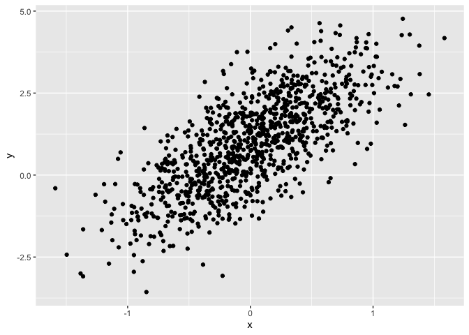
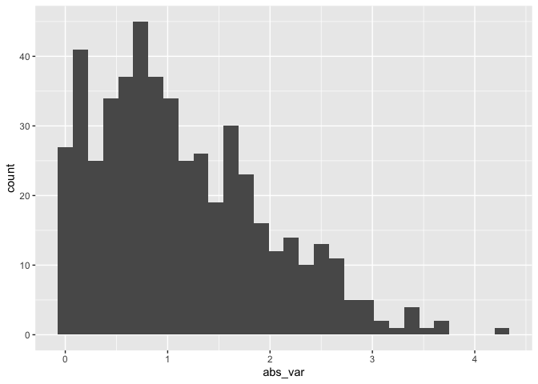
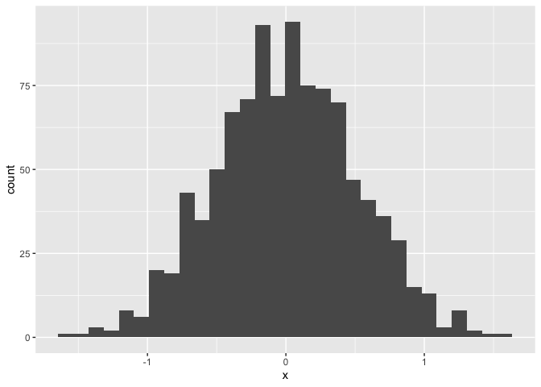

Simple document
================
Lauren Holley
2026-09-17

`html_document:` `toc: True` `toc_float: True`

    `word_document`

I’m an R Markdown document!

# Section 0: libraries

``` r
library(tidyverse)
```

    ## ── Attaching core tidyverse packages ──────────────────────── tidyverse 2.0.0 ──
    ## ✔ dplyr     1.2.1     ✔ readr     2.2.0
    ## ✔ forcats   1.0.1     ✔ stringr   1.6.0
    ## ✔ ggplot2   4.0.3     ✔ tibble    3.3.1
    ## ✔ lubridate 1.9.5     ✔ tidyr     1.3.2
    ## ✔ purrr     1.2.2     
    ## ── Conflicts ────────────────────────────────────────── tidyverse_conflicts() ──
    ## ✖ dplyr::filter() masks stats::filter()
    ## ✖ dplyr::lag()    masks stats::lag()
    ## ℹ Use the conflicted package (<http://conflicted.r-lib.org/>) to force all conflicts to become errors

# Section 1

Here’s a **code chunk** that samples from a *normal distribution*:

``` r
samp = rnorm(100)
length(samp)
```

    ## [1] 100

# Section 2

I can take the mean of the sample, too! The mean is 0.1325945.

# Section 3: a tibble

“option command i” to create more code chunk

``` r
plot_df =
  tibble(
    x = rnorm(1000, sd = 0.5),
    y = 1 + 2 * x + rnorm(1000)
  )
```

# Section 4: plots

These are plots from our random sample

``` r
ggplot(plot_df, aes(x = x)) + geom_histogram()
```

    ## `stat_bin()` using `bins = 30`. Pick better value `binwidth`.

<!-- -->

``` r
ggplot(plot_df, aes(x = x, y = y)) + geom_point()
```

<!-- -->

# Section 5: Learning Assessment 2

Learning assessment: Write a named code chunk that creates a dataframe
comprised of: a numeric variable containing a random sample of size 500
from a normal variable with mean 1; a logical vector indicating whether
each sampled value is greater than zero; and a numeric vector containing
the absolute value of each element. Then, produce a histogram of the
absolute value variable just created. Add an inline summary giving the
median value rounded to two decimal places. What happens if you set eval
= FALSE to the code chunk? What about echo = FALSE?

This plot shows the distribution of the absolute value of
$X \sim N(1, 1)$

``` r
set.seed(0)

la_df =
  tibble(
    num_var = rnorm(n = 500, mean = 1),
    log_var = num_var > 0,
    abs_var = abs(num_var)
  )

ggplot(la_df, aes(x = abs_var)) + geom_histogram()
```

    ## `stat_bin()` using `bins = 30`. Pick better value `binwidth`.

<!-- -->

log_var is a logical vector returning true or false

The median is 0.94

## \# Section 6: Text formatting

*italic* or *italic* **bold** or **bold** `code` superscript<sup>2</sup>
and subscript<sub>2</sub>

## Headings

# 1st Level Header

## 2nd Level Header

### 3rd Level Header

## Lists

- Bulleted list item 1

- Item 2

  - Item 2a

  - Item 2b

1.  Numbered list item 1

2.  Item 2. The numbers are incremented automatically in the output.

## Tables

| First Header | Second Header |
|--------------|---------------|
| Content Cell | Content Cell  |
| Content Cell | Content Cell  |

# Section 7: Learning Assessment 3

After the previous code chunk, write a bullet list given the mean,
median, and standard deviation of the original random sample.

- The median is: 0.94

- The mean is: 1

- The standard deviation is: 0.99

What if I try to add a histogram

``` r
ggplot(plot_df, aes(x = x)) + geom_histogram()
```

    ## `stat_bin()` using `bins = 30`. Pick better value `binwidth`.

<!-- -->
